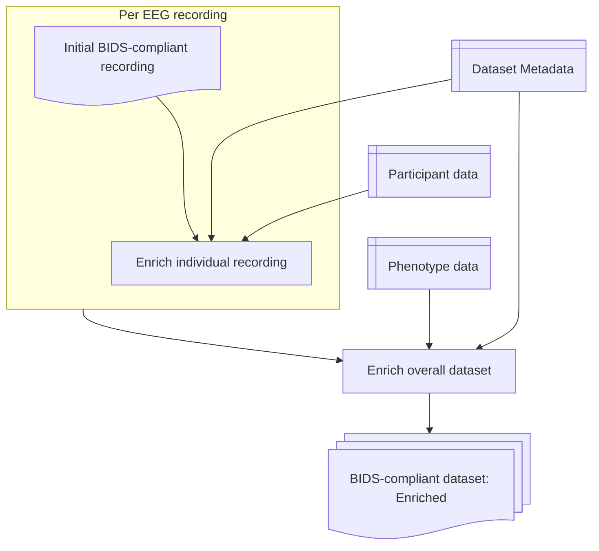

# Enrichment

As described prevously MNE-BIDS is not able to add all the metadata descibed in the metadata JSON to the BIDS-compliant dataset it creates. So, to ensure that the individual recordings and the dataset more generally are described in as complete a manner as possible thisstage enriches them further.

At this stage additional data is written to the EEG data file sidecar, including: Any software or Hardware filters described for acquisition, the device information, the reference and ground electrodes, etc.

In addition, for each recording any channels with missing BIDS types and units are updated in the channels tsv file.

Once this is complete for all recordings in the dataset the overall dataset description JSON file is update with provided information. If phenotype data has been provided then the data and codebook will also be written to the appropriate place.

